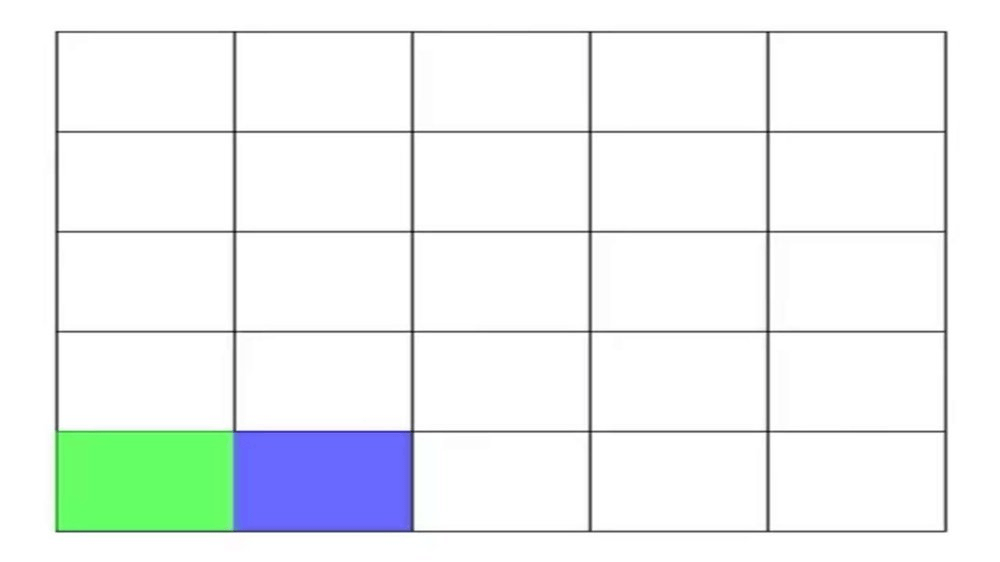

# Maze Generator

This is a python project to generate a random maze of dimension m x n. It implements the Depth First Search algorithm and graph theory to remove certain edges based on the cell matrix such that it removes all the cycles from a matrix. Thus forming a maze based on the inputs given by User. User has a choice for any dimensions as well as any colour combination for background and foreground in real time.

  



## Installation

- Use the package manager [pip](https://pip.pypa.io/en/stable/) to install required dependencies.

```bash
pip install -r requirements.tct
```

- Run the Maze Generator

```bash
python maze_generator.py
```

## Usage

- Run the above commands and start the program.
- Enter the required dimensions for the maze
- Select the required color scheme for the maze.
- Generated Maze diagrams will be available in the Figures folder of the project.
- maze.svg file will contain the svg for the generated maze.

## License

[MIT](https://choosealicense.com/licenses/mit/)
